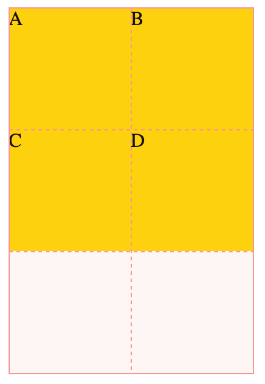

# CSS Layout Practice

This repository is created for practising CSS layout. It contains examples and exercises to help me master the CSS Layout.

## Table of Contents

- [Practice01 - Create Grids](#practice01---create-grids)

## Practice01 - Create Grids

Use two different ways to create a 3 \* 2 grid.

Result:

## Practice02 - Navigation Bar

Create a navigation bar similar to the image below.

Mobile

Tablets (768px) and wider screens

